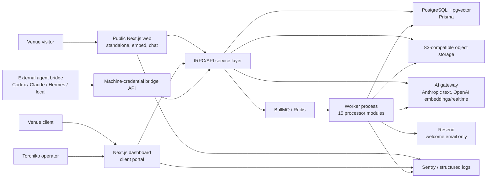

# Torchiko State of System

| Snapshot field             | Value                                                                                                                                                                                               |
| -------------------------- | --------------------------------------------------------------------------------------------------------------------------------------------------------------------------------------------------- |
| Current-truth overlay      | 2026-08-25, America/Chicago                                                                                                                                                                         |
| Machine-readable authority | [`torchiko-current-truth.json`](./torchiko-current-truth.json), verified by `scripts/current-truth-docs.test.mjs`                                                                                   |
| Historical audit baseline  | 2026-08-19 on `codex/torchiko-cloud-staging-20260819` at `4cbf8a677d0b4f8f4dc76e935ea0d00d6dcf0b8b`                                                                                                 |
| Current local evidence     | Clean integrated release candidates; provider-dark golden lifecycle; digest-pinned PostgreSQL/pgvector, Redis, MinIO and ClamAV; worker health mode                                                 |
| Confidence                 | High for integrated code-supported and provider-dark local behavior; medium/unknown for current hosted staging/production state, live providers, customer contact, real billing, and customer usage |

## Current Truth Overlay

The 2026-08-19 audit narrative remains historical evidence, not an unqualified statement of current capability. The following identifiers are the current anchors; every one is defined with repository evidence and an explicit remaining boundary in `torchiko-current-truth.json`:

| Truth ID                        | Current state                                                                                                |
| ------------------------------- | ------------------------------------------------------------------------------------------------------------ |
| `release-evidence`              | Exact candidate assessments and handoffs have an immutable, capability-gated platform projection.            |
| `golden-venue-lifecycle`        | The disposable end-to-end lifecycle and seven failure classes are retained and provider-dark locally proven. |
| `native-guest-read`             | Default-dark exact-venue native reads and immediate compatibility rollback are provider-dark proven locally. |
| `crm-pipeline`                  | Implemented internally; external provider continuity, pricing, promises, and customer contact remain gated.  |
| `outreach-operations`           | Reviewed workflow is implemented dark by default; sending remains unauthorized.                              |
| `stripe-billing`                | Test-mode lifecycle is sandbox-proven; live billing remains unconfigured and unauthorized.                   |
| `gmail-correspondence`          | OAuth/Pub/Sub/sync/source-reference foundations exist; credentials and hosted continuity remain gated.       |
| `local-staging-infrastructure`  | Five local dependency images are content-addressed and health-checked; this does not prove Railway state.    |
| `operational-usage-evidence`    | Fresh queue gauges and declared intake/media bytes are retained without assigning money or policy.           |
| `privacy-retention`             | Privacy status and read-only disposition preview exist; policy and destructive execution remain open.        |
| `claim-attribution-calibration` | Exact-claim reviews and independent-reviewer agreement are retained without a correctness threshold.         |

## How to read this report

The source code, schema, tests, executable configuration, local staging runtime, and inspected UI are the evidence base. Plans and older implementation packets were used only as leads. Statuses mean:

- **PRODUCTION-READY** — implemented, integrated, reasonably tested, and usable; this does not imply that a production deployment was observed.
- **IMPLEMENTED BUT NEEDS POLISH** — functional, but UX, reliability, verification, or integration needs work.
- **PARTIALLY IMPLEMENTED** — meaningful implementation exists, but a major part of the promised workflow is absent.
- **SCAFFOLDED** — schema, contract, route, or component exists without much usable end-to-end behavior.
- **DOCUMENTED ONLY** — described but not meaningfully implemented.
- **LEGACY / SUPERSEDED** — retained compatibility path, not the preferred architecture.
- **BROKEN** — intended flow fails in the inspected state.
- **UNKNOWN** — the repository and safe local checks cannot establish the claim.

## Executive Summary

Torchiko is a substantial multi-tenant venue intelligence platform, not a prototype landing page. PathFinder is its implemented venue application: a public conversational guide, a deliberately simple client portal, a deep internal operating system, a content/intake/release pipeline, analytics and reports, and a durable background-job layer. “Torchiko” is increasingly the customer-facing umbrella; “PathFinder OS” remains the internal application and repository vocabulary. Hermes is not a separate in-repository platform today. It appears as one optional external agent-bridge provider alongside Codex, Claude, and OpenAI-compatible local runners.

The strongest engineering is below the visible product. Tenant-scoped procedures, database guardrails, explicit bypass registries, idempotent chat turns, leases, retries, immutable evidence, AI budget reservations, public-surface manifests, quarantine-aware uploads, and a unusually comprehensive test suite show serious operational thinking. The public chat, remote onboarding, client portal, and admin workspaces are visually deliberate and have good empty/error states. Content packages, native releases, evaluation runs, agent runs, support cases, and audit records have real persistence and lifecycle code rather than only UI mocks.

The main maturity gap is now hosted and provider-backed operational proof. The original audit could not prove a realistic lifecycle. A later disposable golden-venue flow now retains provider-dark proof across client/venue creation, intake, review, package/evaluation evidence, release and rollback, grounded deterministic chat, feedback, reporting, support, operational updates, export evidence, and seven failure classes. It deliberately does not prove live-provider answer quality, voice WebRTC, real customer delivery, hosted recovery, cancellation, or deletion.

The largest product gaps in the audited baseline have partly closed. CRM/pipeline, reviewed outreach, Gmail inbound/source retrieval, and Stripe sandbox billing are now implemented foundations with explicit external gates; they must not be described as absent or as autonomously activated. Meeting scheduling, refund/credit authority, turn-by-turn navigation, automatically applied agent learning, and broad multichannel delivery remain absent or policy-gated. The client portal intentionally hides most analytics and content-management power, so internal operators still carry much of the workload. Bounded citation projection exposes safe provenance for explicitly named retrieved records and persists it across replay. Newly generated answers also retain private content-addressed prompt/source evidence and support append-only, evaluator-attributed exact-claim review. Independent human reviews can now produce deterministic, segmentation-independent agreement evidence without exposing answer/source text or applying a threshold. This still does not prove semantic correctness, and no representative calibrated corpus, approved threshold, or provider-backed staging history exists. Location V1 resolves known location context, but does not provide turn-by-turn routing. Outcome observations can be assembled into immutable, versioned improvement hypotheses with human review; approval deliberately applies nothing and changes no authority.

The highest immediate value is no longer creating the first provider-dark golden flow; that evidence exists. The next leverage point is to retain the exact integrated candidate, deploy it only through the authorized staging boundary, and repeat the golden flow against hosted services and approved providers. That exercise should drive provider quality, voice, notification delivery, client visibility, recovery posture, and observability without enabling customer contact or live billing.

### Health assessment

**Overall: healthy engineering foundation, credible private-beta product, not yet operationally proven as a self-serve or high-scale SaaS.** There was no test, typecheck, lint, build, static-boundary, local health, accessibility, or browser-foundation failure. Risks concentrate in incomplete commercial workflows, application-layer-only tenancy, unproven provider/cloud execution, missing retention automation, and the cost/complexity of parallel legacy and native content models.

### Biggest bottlenecks

| Kind        | Bottleneck                                                                                                                                        |
| ----------- | ------------------------------------------------------------------------------------------------------------------------------------------------- |
| Operational | Provider-dark lifecycle evidence exists; the equivalent hosted/provider-backed lifecycle and current deployment parity remain unproven.           |
| Technical   | Two content/deployment generations coexist, and 193 approved tenant-isolation bypass calls plus 94 raw-SQL operations increase review burden.     |
| Product     | Clients intentionally have narrow configuration; CRM, billing, and communication foundations exist but external operation remains tightly gated.  |
| UX          | Provider-backed chat/voice quality, authenticated hosted mobile workflows, and the final owner/legal privacy text remain unproven.                |
| Scale       | Human review, onboarding, package approval, support, and exception handling still concentrate in a sophisticated but operator-heavy admin system. |

## Changes Since Previous Audit

No earlier `docs/system-state/TORCHIKO_STATE_OF_SYSTEM.md` existed, so this is the baseline. Relative to older architecture and packet documents, the current working tree materially adds product entitlements, provider-neutral capability routing, realtime voice foundations, conversation insights, operational events, knowledge-change proposals, Location V1, message feedback, broader agent-question types, and multimodal/voice usage rollups. These additions are uncommitted at audit time and must not be described as deployed.

Architecturally, the repository has moved from a venue CRUD/chat application toward immutable content revisions and manifests, native releases, durable job dispatch, evaluations, persistent agents, and a unified operations attention console. The older `Place`/`VenueKnowledgeEntry` and `VenuePackage` paths remain active compatibility systems. No regression was found by the automated suite, but the working tree is a large integration surface (61 tracked files changed plus many untracked files and migrations), so a clean review/commit boundary is still needed.

## System Map

### Repository shape

- `apps/web`: public marketing, venue shell, guest chat, embed/widget, health route.
- `apps/dashboard`: Clerk-authenticated client portal and platform-admin operating system.
- `apps/workers`: BullMQ workers, schedulers, leases, recovery, media, agents, reports, evaluations, embeddings, and analytics.
- `packages/api`: tRPC routers, HTTP-facing logic, admin router modules, MCP/agent-bridge actions, context building, and authorization.
- `packages/db`: integrated Prisma schema, 183 migrations, tenant middleware, auditable domain actions, raw SQL, lifecycle helpers.
- `packages/ai`: model/embedding registries, centralized gateway, budgets, workload configuration, capability routing, realtime voice.
- `packages/contracts`: Zod contracts for guest responses, content, packages, evaluations, entitlements, characters, and operations.
- `packages/jobs`, `analytics`, `auth`, `config`, `intake-engine`, `ui`: shared infrastructure and domain packages.

The repo contains 13 workspaces, 757 production source files, 565 test files, 73 dashboard pages, 6 public-web pages, 92 API-router source files, and 15 worker processor modules. These counts describe breadth, not maturity.

### Public surfaces

The canonical allowlist is `packages/api/src/testing/public-surface-manifest.json`: 18 public tRPC procedures, 18 HTTP route modules, and 10 dashboard public API path groups. Public tRPC covers health, venue lookup, chat, analytics collection, public-interest intake, feedback, location resolution, widget availability, and voice lifecycle. Clerk/Stripe/Resend/Gmail webhooks, agent and MCP bridges, separately authenticated platform-worker routes, web/dashboard tRPC, health, and widget readiness are the significant HTTP surfaces.

## Product Surface Inventory

| Area      | Feature                                     | Status                           | Evidence / Location                                                                                                                                                                                     | Quality                                                        | Important Notes                                                                                                                                                                                                                                                                                               |
| --------- | ------------------------------------------- | -------------------------------- | ------------------------------------------------------------------------------------------------------------------------------------------------------------------------------------------------------- | -------------------------------------------------------------- | ------------------------------------------------------------------------------------------------------------------------------------------------------------------------------------------------------------------------------------------------------------------------------------------------------------- |
| Visitor   | Venue chat and session persistence          | IMPLEMENTED BUT NEEDS POLISH     | `packages/api/src/routers/chat.ts`; `packages/db/src/helpers/guest-chat-turn-actions.ts`; `apps/web/components/VenueChatExperience.tsx`                                                                 | Strong reliability design                                      | Durable reservation/claim/finalization and retry IDs; local provider-disabled failure was understandable only at a technical level.                                                                                                                                                                           |
| Visitor   | Grounded semantic retrieval                 | PRODUCTION-READY                 | `packages/db/src/helpers/semantic-search.ts`; `packages/api/src/lib/venue-context.ts`                                                                                                                   | Strong                                                         | pgvector ranking is venue/tenant/visibility scoped; live answer quality was not provider-tested.                                                                                                                                                                                                              |
| Visitor   | Structured responses/actions                | IMPLEMENTED BUT NEEDS POLISH     | `packages/contracts/src/guest-response.ts`; `apps/web/components/ResponseRenderer.tsx`                                                                                                                  | Broad contract, good renderer                                  | Contract is ahead of what the chat generator consistently produces.                                                                                                                                                                                                                                           |
| Visitor   | Citations and claim evidence                | PARTIALLY IMPLEMENTED            | citation contract/renderer; deterministic guest citation projection; `docs/guest-answer-attribution.md`; append-only attribution and independent-reviewer agreement evidence                            | Conservative visitor proof; strong internal evidence integrity | Explicitly named retrieved records can expose safe provenance. Internal reviewers can bind exact claims to frozen evidence and compare independent review agreement, but semantic correctness, a representative calibrated corpus, provider-enabled staging QA, and visitor-visible claim UX remain unproven. |
| Visitor   | Multilingual chat                           | IMPLEMENTED BUT NEEDS POLISH     | `apps/web/components/LanguagePicker.tsx`; language-aware chat request/context                                                                                                                           | Good UI                                                        | Ten languages are selectable; translation is model behavior, not a translation pipeline; no live quality verification.                                                                                                                                                                                        |
| Visitor   | Realtime voice                              | PARTIALLY IMPLEMENTED            | `packages/api/src/routers/voice.ts`; `packages/ai/src/realtime-voice.ts`; `apps/web/components/VoiceControl.tsx`                                                                                        | Serious foundation                                             | WebRTC ephemeral auth, quota, transcripts, usage exist; feature/entitlement/provider gated and unverified live.                                                                                                                                                                                               |
| Visitor   | Location awareness                          | IMPLEMENTED BUT NEEDS POLISH     | guest anchor/catalog/route resolvers; responsive route planner; guarded admin floor/anchor/connection workspace; `torchiko.locations.propose_draft`; location intelligence schema                       | Safe resolver and progressive review lifecycle                 | Visitors can select reviewed destinations and receive bounded shortest-path guidance with strict accessibility filtering. Weighted routing, real-venue/device QA, and live turn-by-turn navigation remain.                                                                                                    |
| Visitor   | Feedback                                    | IMPLEMENTED BUT NEEDS POLISH     | `packages/api/src/routers/feedback.ts`; `MessageFeedback` migration/UI                                                                                                                                  | Useful foundation                                              | Persistence and controls exist in current uncommitted work; operator closed loop remains thin.                                                                                                                                                                                                                |
| Visitor   | Branding/Tochi                              | IMPLEMENTED BUT NEEDS POLISH     | venue bot/design modules; character system; `apps/web/components/VenueChatShell.tsx`                                                                                                                    | Polished                                                       | Only `tochi-dev-v0` is currently verified and it is non-publishable development art.                                                                                                                                                                                                                          |
| Client    | Simple portal, single/multi-venue           | PRODUCTION-READY                 | `apps/dashboard/components/DashboardOverview.tsx`; `(app)` routes; portal router                                                                                                                        | Deliberately simple and polished                               | Venue selection and status are clear; current demo data is empty.                                                                                                                                                                                                                                             |
| Client    | Remote onboarding/uploads                   | IMPLEMENTED BUT NEEDS POLISH     | `RemoteOnboardingJourney.tsx`; `IntakeFileUpload.tsx`; portal onboarding/intake routers                                                                                                                 | Excellent safeguards                                           | Website, notes and resumable files; client cannot publish; real extraction-to-release lifecycle unproven.                                                                                                                                                                                                     |
| Client    | Analytics/chat logs/content editing         | PARTIALLY IMPLEMENTED            | privacy-bounded visitor pulse; service-led correction request; legacy authoring routes redirect; admin surfaces hold full tools                                                                         | Safe and intentionally narrow                                  | Clients see aggregate activity/quality signals and can request a correction, but cannot inspect raw conversations or direct-publish.                                                                                                                                                                          |
| Client    | Weekly reports                              | IMPLEMENTED BUT NEEDS POLISH     | weekly report routes/components; worker processor and DB lifecycle                                                                                                                                      | Strong lifecycle                                               | Clients only see published reports; no delivered current report was available.                                                                                                                                                                                                                                |
| Client    | Support                                     | PRODUCTION-READY                 | `packages/api/src/routers/support.ts`; `SupportWorkspace.tsx`; admin support operations                                                                                                                 | Strong                                                         | Good state handling and internal handoff model. Email-channel support is absent.                                                                                                                                                                                                                              |
| Client    | Roles/account                               | IMPLEMENTED BUT NEEDS POLISH     | Clerk auth/org sync; tenant/membership models; settings                                                                                                                                                 | Adequate                                                       | Owner/admin/member exist; sophisticated entitlement/billing administration is internal.                                                                                                                                                                                                                       |
| Client    | Billing/payments                            | IMPLEMENTED BUT LIVE GATED       | Stripe test-mode checkout, signed webhooks, invoice/subscription projection, entitlement evaluation, reconciliation, Portal, and governed client/admin/agent surfaces                                   | Sandbox-proven; not authorized for live collection             | Commercial/legal readiness, live provider configuration, scheduled lifecycle proof, and explicit production billing approval remain open.                                                                                                                                                                     |
| Admin     | Client/venue command center                 | PRODUCTION-READY                 | `apps/dashboard/app/(admin)/admin`; admin shell/directory/operations                                                                                                                                    | Visually and functionally strong                               | Clear hierarchy; deep breadth still imposes operator learning cost.                                                                                                                                                                                                                                           |
| Admin     | Content/intake/package/release controls     | IMPLEMENTED BUT NEEDS POLISH     | admin routers/components; manifest and native-release helpers                                                                                                                                           | Deep safety model                                              | End-to-end real venue proof is the missing piece.                                                                                                                                                                                                                                                             |
| Admin     | AI controls, costs, evaluations             | IMPLEMENTED BUT NEEDS POLISH     | AI config, cost/budget forms, evaluation operations                                                                                                                                                     | Strong internals                                               | Local provider execution disabled; live routing/fallback not verified.                                                                                                                                                                                                                                        |
| Admin     | Operations attention console                | IMPLEMENTED BUT NEEDS POLISH     | `attention-console.ts`; `OperationsAttentionConsole.tsx`                                                                                                                                                | Coherent command-center direction                              | Aggregates jobs, evals, support, agents, questions, approvals, outcomes and events.                                                                                                                                                                                                                           |
| Admin     | CRM/sales/outreach                          | IMPLEMENTED BUT EXTERNAL GATED   | prospect organizations, venues, contacts, opportunities, stages/activity, provenance, research/import, correspondence, meetings, follow-up, reviewed outreach, and durable customer/location conversion | Strong local operating model                                   | Prospect-to-client conversion is retry-fenced; live Gmail credentials, delivery activation, pricing, promises, and customer contact remain gated.                                                                                                                                                             |
| Email     | Welcome email                               | IMPLEMENTED BUT NEEDS POLISH     | `send-welcome-email.ts`; Clerk webhook/job tests                                                                                                                                                        | Narrow and reliable                                            | Only automated send found; still uses PathFinder branding/link.                                                                                                                                                                                                                                               |
| Email     | General inbound/outbound/approval           | IMPLEMENTED BUT EXTERNAL GATED   | Gmail OAuth/Pub/Sub and sync adapters; correspondence metadata/knowledge; reviewed outreach outbox, rate policy, and workers                                                                            | Strong dark-by-default foundation                              | Provider credentials and live watch renewal are not configured here; delivery remains disabled by default and no autonomous customer contact is authorized.                                                                                                                                                   |
| Agents    | Durable identities/runs/questions/approvals | IMPLEMENTED BUT NEEDS POLISH     | agent Prisma models; admin agent routers/UI; `agent-run.ts`                                                                                                                                             | Strong state machine                                           | Real direct Anthropic execution exists; local live run not verified.                                                                                                                                                                                                                                          |
| Agents    | Specialist delegation/tool use              | PARTIALLY IMPLEMENTED            | MCP registry/read actions; bridge runner; delegation records                                                                                                                                            | Conditional                                                    | Direct worker is text-only; actual tools/delegation require an external bridge.                                                                                                                                                                                                                               |
| Agents    | Learning from outcomes                      | SCAFFOLDED                       | `AgentOutcomeObservation` writes/reads/UI                                                                                                                                                               | Persistence only                                               | No consumer changes prompts, routing, reputation, policies, or model selection.                                                                                                                                                                                                                               |
| Events    | Operational event center                    | IMPLEMENTED BUT NEEDS POLISH     | operational-event helpers/models; attention console; tenant and platform producers                                                                                                                      | Good in-app core                                               | Tenant events have a dark-by-default external route; platform-owned events remain in-app only.                                                                                                                                                                                                                |
| Events    | Email/SMS/push/Slack/webhook delivery       | IMPLEMENTED BUT EXTERNAL GATED   | tenant delivery/outbox/attempt models; Resend adapter; BullMQ worker/scheduler; development sink; retry/suppression audit                                                                               | Strong dark-by-default email foundation                        | Operator email is implemented but not activated or provider-proven here; SMS/push/Slack/webhook and external platform-event delivery remain unimplemented.                                                                                                                                                    |
| Quality   | Evaluation lifecycle/regressions            | IMPLEMENTED BUT NEEDS POLISH     | evaluation contracts/models/worker/admin UI                                                                                                                                                             | Unusually strong                                               | Frozen snapshots, thresholds, budgets and human review; no current production dataset/run history observed.                                                                                                                                                                                                   |
| Knowledge | Legacy Place/knowledge                      | LEGACY / ROLLBACK REQUIRED       | `place.ts`, `knowledge.ts`, `legacy-content-actions.ts`; native guest-read authorization/ranking fallback                                                                                               | Still required                                                 | The compatibility result remains the visibility/ranking index and immediate rollback path. Retirement is unauthorized until representative hosted evidence and a separately approved cutover prove it safe.                                                                                                   |
| Knowledge | Native module/revision/publication model    | IMPLEMENTED BUT ACTIVATION GATED | content models/actions, manifests, native deployments, native guest-read executor/preflight, exact-head/evaluation gates                                                                                | Provider-dark executor proven locally                          | `DARK` and `ACTIVE` are exact-venue policy modes; missing IDs or invalid policy/head/evaluation evidence fail the whole request to compatibility. Genuine quality/rollback references, hosted rehearsal, and production approval remain open.                                                                 |
| Intake    | Multimodal media ingestion                  | IMPLEMENTED BUT NEEDS POLISH     | `media-ingestion.ts`; storage/ClamAV/FFmpeg/OpenAI plumbing                                                                                                                                             | Guarded and tested                                             | Image/audio/video/ZIP/doc flows exist; no dedicated OCR engine found and live providers were disabled.                                                                                                                                                                                                        |
| Reporting | Events, rollups, insights, reports          | IMPLEMENTED BUT NEEDS POLISH     | analytics package/router; daily/weekly/analysis workers                                                                                                                                                 | Broad                                                          | AI-generated summaries and conditional report sections exist; production correctness/usage not proven.                                                                                                                                                                                                        |
| Security  | Auth and application tenant isolation       | PRODUCTION-READY                 | Clerk context; `trpc.ts`; tenant middleware; verification scripts                                                                                                                                       | Strong application controls                                    | No database row-level security; bypass/raw-SQL surface needs disciplined review.                                                                                                                                                                                                                              |
| Privacy   | Retention/deletion                          | PARTIALLY IMPLEMENTED            | retention inventory/readiness contract; offboarding/export                                                                                                                                              | Explicitly incomplete                                          | All policy decisions must be set; no general retention/deletion executor found.                                                                                                                                                                                                                               |
| Infra     | Local staging                               | PRODUCTION-READY                 | compose/local-staging scripts and live health                                                                                                                                                           | Good developer surface                                         | Postgres, Redis, MinIO, ClamAV healthy during audit.                                                                                                                                                                                                                                                          |
| Infra     | Railway staging/production                  | PARTIALLY IMPLEMENTED            | three Railway service configs, Dockerfiles, staging verifier                                                                                                                                            | Code-supported                                                 | Actual deployed services, secrets, migrations, domains, and alerting were not inspected.                                                                                                                                                                                                                      |
| Infra     | Backup/recovery                             | IMPLEMENTED BUT NEEDS POLISH     | backup script/tests; prior restore evidence docs                                                                                                                                                        | Manual safety path                                             | Prior archive/restore evidence exists, but Supabase Free plan had no scheduled backups/PITR; current provider state unknown.                                                                                                                                                                                  |

## User Journey Status

### Visitor

A visitor can open a branded venue route or embed, receive suggested questions, choose a language, persist an anonymous scoped session, and send retry-safe chat turns. The API validates venue/experience visibility, rate limits, retrieves public venue knowledge, records analytics, and produces structured responses. Privacy and “verify important details” messaging are visible. Guest failures now use browser-safe codes for provider unavailable, rate limited, outcome ambiguous, content unavailable, rejected, and transient pre-dispatch failure. Known failures receive definite recovery guidance; only genuinely unclassified transport outcomes retain exact idempotent retry or history reconciliation. Provider route exhaustion commits a safe fallback and emits a deduplicated operational event. Deterministic citations expose safe provenance for explicitly named retrieved records and persist across exact replay/reload; this is not claim-level semantic attribution. Realtime voice and the failure taxonomy still need provider-enabled staging proof, and turn-by-turn routing does not exist.

### Venue client

A Clerk-authenticated client sees a clean “today” portal, can switch among venues, inspect status, upload onboarding sources, add website/staff context, view published weekly reports, request support, and manage basic account data. The product intentionally routes old analytics and authoring screens away from clients. This makes the portal safe and understandable, but it also means customers depend on Torchiko operators for content correction, publishing, deep analytics, model settings, packages, and most lifecycle actions.

### Torchiko operator/admin

A platform admin has the most complete journey: command center, client directory, venue workspace, onboarding intake, media, content revisions, compatibility content, packages, native releases, reports, chat logs, evaluations, agents, support, credentials, offboarding, costs, and AI incident controls. Dangerous operations tend to require explicit state transitions, typed reasons, or scoped identifiers. The journey is genuinely usable module by module, but the breadth and coexistence of old/new systems make it easy to operate the wrong abstraction without the handoff guide.

### AI agent

An operator can configure a disabled identity, enable it, compose a scoped task, persist a run, enqueue it, observe leases/retries/costs, answer structured questions, approve/reject actions, and record outcomes. A direct Anthropic worker executes text-only runs. Codex/Claude/Hermes/local providers require a separate bridge runner with machine credentials. Direct runs do not have tools and cannot perform autonomous changes. Outcome observations do not train or adapt the agent. Local staging had queued synthetic runs but provider execution disabled, so the full journey was not verified.

### Prospect → customer

The current system has a platform-owned prospect CRM with organizations, venues, multiple contacts, opportunity/stage/activity history, provenance, research/import state, correspondence, meetings, follow-up, reviewed outreach, and durable customer/location conversion history. Client and venue creation can begin from a prospect-prefilled operator flow; the conversion is bound inside the retry-fenced server workflow before its durable client-create intent completes, preserving CRM history into onboarding. Live correspondence still depends on unconfigured Gmail OAuth/Pub/Sub/watch renewal, delivery remains dark by default, pricing and consequential promises remain founder gated, and the public marketing demo entry remains a simple email path rather than a fully automated lead capture surface.

### New venue onboarding

The client-side capture experience and internal intake/review/release systems exist. Upload policy includes per-file and per-venue limits, resumability, quarantine, malware scanning, verification states, evidence and proposal review, package manifests, evaluation evidence, and publish controls. The missing proof is a retained golden run using realistic mixed source material through to a live guest answer. Manual review and operator release remain intentional scaling gates.

### Venue content update

Updates can enter through client onboarding/support or admin content tools, become immutable module revisions/proposals, be reviewed, included in a package/manifest, evaluated, and released. Legacy Place/knowledge editing remains separately available. The runtime guest-read executor is default-dark and exact-venue gated by server policy, strict feature metadata, the applied immutable native head, matching PASS evaluation evidence, and production approval where applicable. `DARK` validates without switching; `ACTIVE` replaces only complete authorized result sets; any drift or missing ID falls the whole request back to compatibility. A disposable two-tenant rehearsal proves active, dark, authorization, isolation, kill-switch, provider-dark chat, and immediate rollback. Representative hosted quality evidence and compatibility retirement remain open.

### Client support request

Clients can open and reply to support cases; operators can triage, request information, assign state, and maintain manual-loop evidence. This is a credible in-app workflow. It has no email ingestion/delivery, no SLA automation, and no refund/payment integration.

### Human approval / AI escalation

Agent questions support yes/no, choice, multi-select, short/long text, approval/reject, date/time, and structured-object answers. Approval requests and decisions are durable and auditable. The attention console combines these with failed jobs, evaluations, support, agent runs, outcomes, and operational events. The in-app path is coherent; external notification and proactive escalation channels are not.

## AI / Agent Architecture

### Model execution

`packages/ai` centralizes text generation, embeddings, realtime voice, model pricing, budget admission/reservations, usage events, workload configuration, and provider-neutral route planning. Today Anthropic handles registered text workloads, OpenAI handles embeddings and realtime voice, and fallback routing can filter unhealthy/disabled providers and models. The current launch-capability work makes future optimization structurally possible because calls record workload, capability, provider, model, tokens, cost estimate, latency, and fallback use.

Model switching is easier for registered application workloads than for agents: change a validated workload configuration/registry entry rather than every caller. A notable mismatch remains in direct agent runs: the identity’s provider decides direct-vs-bridge execution, but the direct worker invokes the hard-coded `AI_MODEL_KEYS.AGENT_RUN`. The displayed/configured identity `modelName` is not itself the executed Anthropic model. That should be made explicit or corrected before advertising per-agent model selection.

### Persistent agents and tools

The database persists identities, runs, actions, timeline events, approval requests/decisions, questions, messages, and outcome observations. Runs have queue records, attempt limits, leases, heartbeat, cancellation, retry, budget, usage, and terminal states. The direct worker is intentionally safe and text-only. Richer MCP read tools, “ask operator,” and delegation exist for connected bridge runners; write authority is disabled/approval-oriented.

Hermes is therefore an adapter choice, not a separate owned subsystem in this repo. The repository does not contain the Hermes runtime, model, memory, or scheduler. It contains a bridge capable of launching a `hermes` command in a separately controlled runner.

### Do agents improve as they work?

**No, not in the strong autonomous sense.** Humans can append an `AgentOutcomeObservation`, and agents/operators can read it. An authorized quality worker or platform admin can prepare one versioned `AgentImprovementProposal` from exact same-scope observations. After human approval, they can append an immutable implementation reference plus a same-corpus before/after evaluation comparison; corpus and evidence drift remain fail-closed, while content/model/config differences must be declared. Approval and validation perform no application and change no authority. There is still no runtime that rewrites instructions, changes routing/models, selects specialists, updates memory, or promotes permissions automatically. This is a bounded reviewed improvement loop, not autonomous self-modification.

### Human-in-the-loop and operations inbox

The strongest direction is the unified admin attention console rather than separate AI widgets. `packages/api/src/routers/admin/attention-console.ts` reads failed jobs, evaluations, approvals, support cases, agent runs/questions/outcomes, and operational events into one prioritized view. Operational events are emitted by chat reliability, voice quota/usage, evaluation regression, knowledge-proposal, CRM, and provider-health flows. Dedupe keys, severity, read/ack/resolved states, actor data, links, and audit trails are implemented. Tenant events also have a dark-by-default operator-email route with durable delivery/attempt state, a BullMQ dispatcher, bounded retry and suppression, and a non-production sink. It is not externally activated or provider-proven here, and platform-owned pre-conversion events remain Founder Control Room-only.

## Data Architecture

The Prisma schema contains 124 models: 113 tenanted, nine platform-scoped, and two shared, enforced by an executable registry. Core identity is `User` → `Tenant`/`Membership` → `Venue`. Public experiences attach visitor sessions, conversation sessions/messages/turns, feedback, voice sessions, and analytics events to the venue.

Knowledge has two generations:

1. **Legacy retrieval:** `Place` and `VenueKnowledgeEntry`, both carrying embeddings and visibility metadata. Guest semantic search currently reads these directly.
2. **Native generalized content:** stable module identities, immutable revisions, typed subtype records, evidence/provenance, proposals, publications, manifests, native releases, and deployment heads.

Intake runs and uploads create verified source evidence and reviewable proposals. Package/manifest records freeze desired state and evaluation evidence; native releases record actual deployment state. Compatibility materialization allows some native changes to flow through older package/venue fields, with explicit limits. This preserves safety and auditability but is the largest source of schema and conceptual drift.

Cross-cutting records include job/audit logs, AI usage and daily rollups, budgets/reservations, report schedules/runs, evaluations, support, credentials, agent operations, operational events, entitlements, retention/offboarding, and location anchors. Append-only and lifecycle-sensitive models are protected in database action helpers and Prisma middleware.

For a future place/city/territory graph, the structured content identities, provenance, location anchors, typed modules, and pgvector foundation help. Venue-first foreign keys, duplicated legacy place semantics, and tenant-coupled publication/retrieval obstruct straightforward cross-venue knowledge sharing. Do not generalize this yet; first converge the venue content read path.

## Infrastructure

Local staging is a well-supported Docker-based environment. During the audit, PostgreSQL/pgvector, Redis, MinIO, and ClamAV were healthy; the web health route returned HTTP 200 with database and queue `up`. The health endpoint does not check object storage, malware scanning, AI providers, email, worker liveness/freshness, scheduler activity, or migration parity.

Railway has separate dashboard, web, and worker configurations plus Dockerfiles and executable staging-config gates. The public web config uses `/api/health`; equivalent deployed dashboard/worker health behavior was not established. A root Railway/Nixpacks configuration coexists with newer service-specific Docker configs and should be declared legacy or removed. No live Railway environment, domains, secrets, metrics, or deployment revision was inspected.

Supabase provides the PostgreSQL target. A password-prompted logical backup script pins PostgreSQL/pgvector client versions, requires SSL, refuses overwrite, uses a consistent snapshot, verifies `pg_restore --list`, and emits a hash/manifest. Older retained documentation records a successful archive and local restore rehearsal. It also records that the Supabase Free plan had no scheduled backups or PITR at that time. Current provider backup settings and a recent restore drill remain unknown.

CI provisions disposable pgvector PostgreSQL, Redis, and MinIO and runs migration, integration, bundle-secret, accessibility, type, lint, test, and build gates. Exact local release candidates run a 26-gate assessment and can be projected as immutable platform evidence. Current remote CI status remains separate. Local compose now pins all five service images by SHA-256 digest; tag text is retained only as human-readable context.

## Security / Tenant Isolation

Clerk supplies user and organization identity. `publicProcedure`, authenticated/tenant procedures, and platform-admin procedures provide backend boundaries; non-admin users cannot access internal routes merely by knowing URLs. Platform impersonation/tenant override is accepted only for platform admins and is cookie-scoped. Public guest routes revalidate venue, experience, visibility, and anonymous-session scope rather than trusting the browser.

Tenant isolation is application-enforced through Prisma middleware, tenant-aware helpers, composite ownership checks, and executable source gates. The audit found 193 approved bypass calls in 65 production files and 94 raw-SQL operations (34 reads, 60 writes). Those are inventoried and tests passed, but each expands the review surface. PostgreSQL row-level security was not found, so a missed predicate remains a plausible cross-tenant risk. This is not evidence of a present leak; it is a defense-in-depth gap.

Other meaningful controls include signed Clerk webhooks, machine credentials stored as hashes with rotation/revocation, server-only secret bundle scans, safe URL/origin contracts, upload size/decompression limits, quarantine and ClamAV, explicit AI kill switches, rate limits, budget admission, immutable evidence, and auditable dangerous actions. Public/embed response headers restrict framing, referrers, capabilities, and MIME sniffing.

Privacy is not complete. Guest messages and identifiers are persisted, but policy-to-execution retention/deletion is not. The retention readiness function intentionally refuses readiness until all required decisions are recorded; no general erasure scheduler/executor exists. Offboarding export/revocation is stronger than deletion. The marketing footer now reaches an honest `/privacy` policy-status surface, but owner/legal policy text is still unresolved. Prompt construction tells the model to use bounded public context, but a dedicated prompt-injection sanitizer/evaluation suite was not found.

## Testing / Quality

### Commands executed in this audit

| Check                                                          | Result                                                                                                                  |
| -------------------------------------------------------------- | ----------------------------------------------------------------------------------------------------------------------- |
| `pnpm test`                                                    | Passed: 3,926 package tests plus 164 script tests; 147 package tests and one script test skipped by environment/gating  |
| `pnpm typecheck`                                               | Passed: 23/23 tasks                                                                                                     |
| `pnpm lint`                                                    | Passed with one warning: raw `` in `apps/web/components/PlaceCard.tsx:70`                                          |
| `pnpm build`                                                   | Passed: 13/13 workspaces; Sentry/OpenTelemetry dynamic-require warnings and Windows standalone-link warnings            |
| `pnpm verify:client-bundles`                                   | Passed: 11 server-only canaries/credential patterns checked across 408 browser-deliverable files                        |
| `pnpm test:accessibility`                                      | Passed: seven focused axe contracts                                                                                     |
| `pnpm test:browser-foundation`                                 | Passed: 186 DOM/browser-foundation tests                                                                                |
| `pnpm test:visual-browser`                                     | Added after the audit snapshot: nine real-Chromium phone/tablet/desktop smokes for Guest routing, portal and onboarding |
| AI/tenant/raw-SQL/public/staging/docker/character static gates | All passed                                                                                                              |
| Local health                                                   | HTTP 200; DB and queue up                                                                                               |
| Browser inspection                                             | Marketing, client home, admin OS, venue workspace, onboarding, and guest chat inspected at 1280×720                     |

The default unit suite skips integrations needing disposable DB/Redis/storage/ClamAV in the current invocation; CI has explicit jobs for many of them. The suite is strongest at state transitions, authorization, tenant predicates, validation, idempotency, worker retry/lease logic, and rendered component contracts. It is weaker at true browser automation across authenticated journeys, provider-backed AI quality, voice WebRTC, deliverability, cloud deployments, restoration, high-volume concurrency, and real mixed-media extraction.

This audit did not mutate tests to obtain green results. The guest chat interaction did create one local staging conversation/turn. Production data was not touched.

## UI / UX Assessment

The visual system is one of Torchiko’s strengths. The marketing page, lightweight client portal, remote-onboarding journey, venue workspace, and admin command center share a considered palette, typography, card language, spacing, and hierarchy. Empty states explain what happens next; upload and publishing screens repeatedly state that client input does not silently publish. Internal navigation groups “build/manage” separately from “observe/improve,” which makes a very large surface more understandable.

The weakest visible areas are not generic styling problems:

- the public chat’s provider-disabled failure copy implies uncertain delivery instead of temporary service unavailability;
- the privacy route is intentionally only a policy-status surface, and final owner/legal content remains unresolved;
- the client portal is so intentionally narrow that analytics/content ownership may feel absent;
- internal pages expose both legacy compatibility and native concepts, increasing decision load;
- brand vocabulary is mixed: Torchiko externally, PathFinder OS internally, PathFinder in the welcome email, Tochi as character/assistant;
- the original audit completed only desktop interactive inspection. A later deterministic Chromium gate now confirms three synthetic phone/tablet/desktop journeys, but real-device, authenticated, deployed and assistive-technology evidence remains absent.

Development fixture routes appear in production build manifests but their page/middleware guards return not-found or require auth outside development. This is acceptable, though route-level exclusion would reduce noise.

## Reporting, Cost, and Observability

Analytics records raw guest events, conversation behavior, answer analyses, clusters/themes, daily rollups, report configurations, weekly digests, and published weekly reports. Conditional report sections and lifecycle evidence are tested. Client access is published-only; internal operators have the complete view. Production data correctness, late-event handling under load, and current report delivery were not independently verified.

AI costs remain the best-instrumented variable cost. Model registries and usage events capture tokens, model/provider, latency, feature/workload, fallback, voice/audio and estimated cost; budgets and reservations bound spend. A provider-neutral append-only operating-cost ledger represents sourced non-AI dollar evidence at platform, tenant, or venue scope. A separate append-only operational-usage ledger now retains fresh queue gauges and tenant/venue-scoped database-declared intake/media bytes without assigning dollars. The Founder Control Room combines wholly contained 30-day cost evidence with AI estimates, identifies unrepresented categories, and shows measured load in the same read-only machine operating view. Real provider ingestion, rate provenance, and accounting reconciliation remain absent, so the result is coverage evidence rather than invoices, margin, pricing truth, or anomaly policy.

An operator can inspect failed jobs, stuck agent/evaluation states, support work, AI incident mode, usage/cost, freshness, package/release status, and some low-confidence chat failures. The Founder Control Room now also shows authenticated service-readiness evidence for exact migrations, worker heartbeat, scheduler/provider-work mode, complete live queue observation, paused queues, and long-running work; the public health response intentionally remains a fast connectivity/deployment probe. Blind spots remain: external uptime, storage/ClamAV/email/provider execution health, outbound event delivery, policy-backed queue-depth alerts, cost anomaly notifications, latency/error trends across every dependency, and automated poor-answer detection from production conversations.

Exact candidate reports and staging handoffs can now be projected offline into immutable,
content-addressed `PlatformReleaseEvidence`. Platform administrators or separately capability-gated
workers may append it; Founder Control Room and bounded workers read the same current/history view.
The database rejects mutation of retained evidence, retries are idempotent, and the surface states
that it confers no staging/production deployment, migration, customer-contact, billing, or
destructive-data authority. Hosted staging proof remains separate.

## Technical Debt / Drift

1. **Dual content/deployment architecture:** legacy `Place`/`VenueKnowledgeEntry`/`VenuePackage` remains on the live read/materialization path beside native modules/revisions/manifests/releases.
2. **Hosted integration boundary:** voice, entitlements, events, feedback, location, CRM, billing, and proposal work are integrated locally but not uniformly proven in current hosted staging.
3. **Application-only tenant enforcement:** strong tooling exists, but the large bypass/raw-SQL inventory is a permanent cognitive risk without database RLS or equivalent defense.
4. **Naming/ownership drift:** Torchiko, PathFinder, Hermes and Tochi roles are inferable but not codified in one canonical architecture note; customer email still says PathFinder.
5. **Schema-ahead behavior:** outcome learning, parts of billing and some structured response blocks imply capabilities their runtimes do not yet deliver; citations now have a bounded runtime but remain short of claim-level attribution. Operational event email has a real dark-by-default runtime, while its external activation and the other advertised channels remain gated or unimplemented.
6. **External readiness gaps:** authenticated core service readiness exists, but green web health still proves only DB/Redis connectivity and external provider/storage/email execution remains unproven.
7. **Documentation fragmentation:** the README is thin on setup, while numerous packet/status documents contain historically useful but stale conclusions.
8. **Deployment configuration overlap:** root Railway/Nixpacks and service Docker configurations coexist.
9. **Hosted dependency ownership:** local service identities are digest-pinned, but hosted Railway dependency versions and health still require explicit observation.
10. **Client/operator imbalance:** safety is achieved partly by making the operator do nearly everything, which becomes operational debt as customers grow.

Systems that should not be casually rewritten include chat turn idempotency, tenant verification gates, immutable revision/manifest evidence, upload quarantine, evaluation run identity, AI budget admission, and worker lease/recovery primitives. Their complexity protects real failure boundaries.

## Scaling Assessment

### 10 venues

The system can plausibly support ten venues if Torchiko accepts hands-on onboarding and review. The immediate pain will be source cleanup, extraction verification, package approval, guest-answer QA, support, and explaining what clients can/cannot edit. Infrastructure is not the limiting factor. A golden onboarding runbook, clear ownership, live provider monitoring, and recovery plan are prerequisites.

### 100 venues

Human queues become the constraint. Intake exceptions, content freshness, package/evaluation approvals, support, report failures, and agent questions need SLA/assignment/bulk operations and real outbound notifications. Client self-service must expand selectively. AI cost and usage instrumentation can support optimization, but infrastructure and human time need one unit-economics view. Application-only tenant enforcement and the bypass inventory deserve a focused security review.

### 1,000 venues

The current operator-centric model will not scale. Torchiko would need automated low-risk content promotion policies, sampled QA, robust multichannel incident notification, queue/worker autoscaling, tested restore/PITR, data lifecycle execution, stronger tenant defense in depth, partition/retention plans for chat/analytics/audit data, and load/concurrency evidence. Queue and database-declared intake/media quantities are now retained as fresh append-only evidence, but they deliberately carry no provider-cost, SLO, anomaly, or autoscaling policy. Cross-venue knowledge should remain explicitly permissioned; it should not be created by weakening venue isolation. These are future requirements, not reasons to pause ten-venue learning.

## Current Blockers

- The exact integrated candidate has strong local evidence but still needs owner-authorized hosted staging integration and observation; local proof is not deployment proof.
- Provider-backed chat, agents, media analysis, evaluation, report generation, and voice quality remain unproven for the current candidate.
- The `/privacy` status surface exists, but owner/legal policy text and executable destructive retention policy remain unresolved and must not be invented.
- CRM, Gmail, bounded outbound, and Stripe test-mode foundations exist; credentials, delivery, customer contact, pricing, live billing, and consequential lifecycle execution remain gated.
- Operator email has a dark-by-default delivery foundation; SMS, push, Slack/webhook, urgent external founder escalation policy, and platform-event external delivery remain incomplete.
- Claim-level semantic citation validation and provider-enabled citation QA remain unproven; bounded retrieved-record provenance is implemented.
- Current hosted migration parity, provider secrets/health, backups/PITR, monitoring, remote CI, and production state have not been established by this local reconciliation.

## Top 10 Things Torchiko Should Do Next

1. **Integrate the exact candidate into authorized staging and retain its evidence** — verify code SHA, migration lineage, runtime health, and rollback without broadening production authority. _Effort M; impact very high._
2. **Repeat the golden lifecycle in hosted staging** — retain onboarding, intake, release/rollback, guest, report, support, update, export, and failure evidence against hosted dependencies. _Effort L; impact very high._
3. **Prove provider quality and fallback deliberately** — run spend-bounded chat/evaluation/voice cases with strong models, then measure any downgrade rather than assuming equivalence. _Effort M; impact very high._
4. **Complete launch-grade visitor and onboarding QA** — authenticated mobile, real devices, accessibility, outage states, and visual regression coverage. _Effort M–L; impact very high._
5. **Resolve privacy/retention policy gates and design the separate executor** — retain read-only previews until founder/legal decisions exist; do not infer destructive authority. _Effort M–L; impact very high._
6. **Converge the content read path** — use existing shadow evidence and an explicit rollback target; do not delete compatibility code prematurely. _Effort L; impact high._
7. **Prove CRM-to-onboarding continuity in staging** — retain exact prospect/customer/location conversion while keeping sending, pricing, and promises gated. _Effort M; impact high._
8. **Verify recovery and cost observability** — current backup/PITR, restore drill, worker/provider/storage health, queue depth, and bounded anomaly safeguards. _Effort M; impact high._
9. **Deepen progressive agent authority evidence** — connect outcomes, rollback, approval acceptance, policy violations, and confidence without automatically loosening policy. _Effort M; impact high._
10. **Activate only explicitly authorized external canaries** — Gmail watch, operator email, Stripe scheduled test lifecycle, and other provider flows remain separately owner-gated. _Effort M; impact medium-high._

## 5 Things We Should Explicitly NOT Work On Yet

1. A city/territory-scale shared knowledge graph before the venue read path converges.
2. Autonomous outbound sales or support email; reviewed foundations exist, but customer-contact authority has not changed.
3. Live billing expansion, refund automation, or invented commercial policy; keep Stripe test-mode evidence separate from authorization.
4. Self-modifying or “self-learning” agents; first measure outcomes and require reviewable policy changes.
5. A wholesale UI redesign; the current design system and primary surfaces are already coherent.

## 5 Areas Already Strong Enough to Leave Alone for Now

1. Chat turn idempotency and durable claim/finalization primitives.
2. Tenant/static-boundary verification tooling and public-surface manifest discipline.
3. Upload admission, quarantine, malware and resource-budget safeguards.
4. Immutable content/package/evaluation evidence and audit-oriented lifecycle design.
5. The visual foundation of the client portal, onboarding journey, and admin workspace.

## If I Were Explaining Torchiko's Current State to Tom in 5 Minutes

You have a real venue product with a surprisingly serious operating system behind it. A visitor can reach a polished venue guide, a client can onboard and ask for support, and you can manage content, releases, reports, AI costs, evaluations, agents, and exceptions from a strong admin workspace. The system has more safeguards than most early products: it is careful about tenant scope, retries, duplicate AI requests, bad uploads, publishing evidence, and human approvals.

What looks more complete than it is is everything around the edges of that core. Voice, location, event delivery, agent learning, billing, CRM, and communications have meaningful foundations, but they are not equally usable or externally activated. Citations expose bounded retrieved-record provenance, not claim-level semantic proof. CRM and reviewed outreach now exist internally; sending, pricing, and promises remain gated. Agents can run and ask questions, but they do not automatically apply learning, and rich tools depend on an external bridge. Clients see a polished but intentionally narrow portal, leaving your team to do most of the work.

The best news is that the core is strong enough for controlled customers and the provider-dark golden lifecycle is now boring and repeatable locally. The caution is that hosted staging, provider-backed quality, real-device use, recovery, and externally gated integrations do not inherit that proof. Establish those deliberately, finish policy-dependent privacy/retention work, verify backups/provider health, and let observed operational pain—not speculative architecture—choose the next build. The system’s human workload, not its database, will determine how quickly it progresses from ten venues toward one hundred.

## Audit limitations

No credentials, production data, provider dashboards, browser profiles, or external services were accessed. The current remote CI/deployment state, production/staging database migration parity, current Supabase backup/PITR configuration, actual email delivery, real AI output quality, live voice/WebRTC, external agent bridges, and real-device/deployed mobile rendering remain unverified. After this audit snapshot, deterministic local Chromium screenshots added bounded phone/tablet/desktop evidence for Guest routing, the single-venue portal and remote onboarding only.

## CRM/outreach branch delta (2026-08-20)

The CRM foundation and outreach operational system described in `IMPLEMENTATION_CRM_FOUNDATION.md` and `IMPLEMENTATION_PROSPECT_OUTREACH_OPERATIONS.md` are integrated in the current lineage. Outbound and inbound adapters remain dark by default; this changes implementation truth but does not prove hosted deployment or authorize customer contact.
