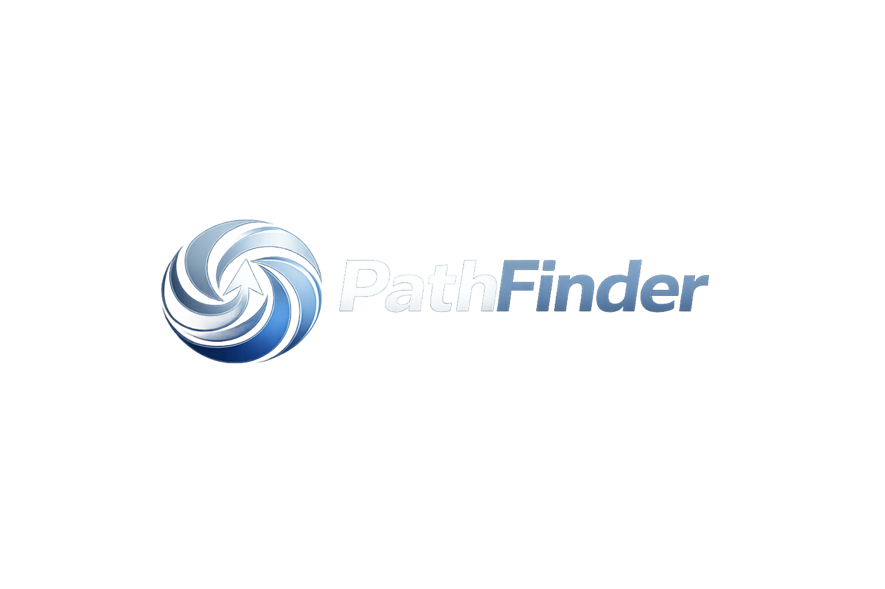

# UI Redesign Intake — PathFinderOS

> Fill in every section below. Where it says "attach file", drop the file into the chat after answering.
> The more specific you are, the less generic the output will be.
> Skip nothing — even "I don't know" is useful.

---

## Part 1 — Brand Direction

**1. Pick the single word that best describes the feeling you want:**

- [ ] Minimal (Apple, Linear, Vercel)
- [ ] Bold (Stripe, Figma, Notion)
- [ ] Editorial (NYT, Airbnb, Loewe)
- [ ] Futuristic (Nothing, Arc, Perplexity)
- [ YES] Warm & approachable (Superhuman, Calm, Duolingo)
- [ ] Other: ****\_\_\_****

**2. On a scale of 1–5, how dark should the overall product be?**
`1 = fully light (Apple.com)` → `5 = fully dark (Linear, Vercel dashboard)`

Answer: 2

**3. List 3–5 websites or apps whose visual style you want to draw from.**
Don't limit it to SaaS — include fashion, editorial, consumer apps, anything.

```
1. Meta
2.REI
3. YETI
4.Nintendo
5. eddie bauer
```

**4. List 1–2 websites or apps whose style you absolutely do NOT want.**
(Helps rule out directions without ambiguity.)

```
1. Google and Microsoft Suites (Docs, Powerpoint, Slides, Word, Excel, etc.)
2.
```

---

## Part 2 — Color

**5. What is PathFinder's primary brand color right now?**
The current code uses `cyan-400` / `cyan-300`. Do you want to keep that, shift it, or start fresh?

- [ ] Keep cyan
- [ ] Shift cyan to something adjacent (teal, electric blue, mint) → describe: ****\_\_\_****
- [ ] Replace entirely → what color/feel? ****\_\_\_****
      I want it to use the ones on my current logo which kind of has a graident of blue/grey. such as #2257a4, #8298b1, #7791ab, #aec3d7, and #5d7692

**6. Should the accent color be a single color, or a gradient?**

- [ ] Single flat color
- [ ] Gradient → describe the direction (e.g., "purple to orange", "dark blue to cyan"): ****\_\_\_****
      chatgpt defined my graident exactly as 1. Deep Base Blue (foundation / shadow)

Hex: #0F2A4A
Use: darkest parts of swirl, depth, shadows
Feel: stability, corporate, trust

2. Primary Blue (main brand color)

Hex: #1F4E8C
Use: main visible blue in the logo
Feel: intelligence, tech, clarity

3. Accent Blue (highlight / motion)

Hex: #3A7BD5
Use: brighter streaks in the swirl
Feel: movement, energy, “exploration”

4. Cool Light Gray-Blue (metallic / premium tone)

Hex: #C9D4E3
Use: upper swirl + highlights
Feel: premium, clean, slightly futuristic

5. Pure White (arrow centerpiece)

Hex: #FFFFFF
Use: arrow in the center
Feel: direction, clarity, focus
**7. What should backgrounds feel like?**

- [ ] Pure white / off-white (very clean, Apple-style)
- [ ] Warm neutral (cream, sand — more editorial)
- [ THIS] Cool neutral (light gray — Linear, Vercel)
- [ ] Dark matte (slate/near-black — Vercel dashboard)
- [ ] Dark with depth (glass, subtle gradients — current direction)

---

## Part 3 — Typography

**8. Do you have a typeface in mind, or should one be chosen?**

- [ ] I have one in mind: ****\_\_\_****
- [ THIS. Go with a vibe that is unique and still easy to read. I dont want it to be one that all tech brands use. it should feel grounded in a sense for the average user.] I don't — choose for me (tell me the vibe you want: geometric, humanist, serif, display)

**9. Should headlines be:**

- [ ] Light/thin weight, large size (Apple, Loewe — elegant)
- [ ] Heavy/bold weight (Stripe, Figma — assertive)
- [ THIS] Mixed — big and thin for hero, heavier for section heads

**10. Is there a specific font that inspired you on any of the reference sites in question 3?**

Note it here (even "I liked the font on X.com"):

```
N/A
```

---

## Part 4 — Layout & Motion

**11. How much whitespace do you want?**

- [ ] Very generous — lots of breathing room, content feels sparse (Apple)
- [THIS ] Balanced — comfortable but not empty (Linear, Stripe)
- [ ] Dense — information-rich, less padding (Notion, Figma)

**12. Should there be scroll animations?**

- [ THIS. Feel Professional] Yes — elements fade/slide in as you scroll (modern SaaS standard)
- [ ] Yes, but subtle — only the hero section
- [ ] No — instant, no motion (fastest, most minimal)

**13. Should cards and panels have visible borders or be borderless?**

- [THIS. As long as it looks professional, i like it. ] Visible subtle borders (current direction)
- [ ] Borderless with shadow instead
- [ ] Borderless and shadowless — separated only by background color

**14. How rounded should corners be?**

- [ THIS ] Very rounded, pill-like (current — `rounded-[2rem]`)
- [ ] Moderately rounded (`rounded-xl` — Stripe, Vercel)
- [ ] Barely rounded (`rounded-md` — more editorial, serious)
- [ ] Sharp corners — no rounding (very bold/editorial)

---

## Part 5 — Surface by Surface

### Marketing page (apps/web — what venue operators and prospects see at pathfinder.app)

**15. What is the single most important thing a visitor should feel in the first 5 seconds?**

```
"Wow, this isn't some overly like AI brand. It's a usable tool for an average guy like me that feels natural and attainable while still looking professional"
```

**16. Do you want a hero image or illustration, or is it pure type + UI mockup?**

- [THIS ] Hero image (real photo — venue, crowd, guests) → see file request below
- [ ] Illustration / abstract graphic
- [ ] Type-only with a UI mockup (current direction)
- [ ] Something else: ****\_\_\_****

**17. Should the marketing page include a live product demo embed (a real scrollable chat mockup)?**

- [ ] Yes — show the chat experience inline
- [THIS ] No — screenshot/static only

---

### Guest chat experience (apps/web/[venueSlug]/chat — what venue guests see on their phone)

**18. This is the most important surface — guests scan a QR code and land here.
What should the experience feel like?**

- [ ] Clean utility — no fuss, just the chat (WhatsApp-style)
- [ ] Premium/branded — feels like the venue's app
- [ ] Immersive — venue photo or color as backdrop, full bleed
- [ ] Minimal light mode — works better in sunlight on a phone
- [ ] Other: ****\_\_\_****

**19. Should the venue's name and branding be prominent at the top of the chat, or subtle?**

- [THIS. I would like it to be so that each venue can name their own AI and that will be the prominent name at the top of the chat. At the bottom, something very small that says "Powered by PathFinder" would be good maybe if it fits. ] Prominent — venue name, maybe a logo banner
- [ ] Subtle — just an icon/wordmark
- [ ] Hidden — PathFinder brand only

**20. Should place cards (the results that appear below AI answers) feel like:**

- [ ] App cards — photo thumbnail, distance chip, small tap target
- [THIS ] Rich cards — bigger photo, more detail, more visual weight
- [ ] Text-only list — no photos, just name + distance

---

### Tenant dashboard (apps/dashboard — what venue staff see on desktop)

**21. Should the dashboard sidebar be:**

- [THIS ] Dark (current)
- [ ] Light
- [ ] Colored (brand accent color)
- [ ] Icon-only / collapsed by default

**22. Should the dashboard feel like:**

- [ THIS] A clean SaaS tool (Linear, Notion — very focused)
- [ ] A data dashboard (Metabase, Grafana — charts prominent)
- [ ] An operations console (dense tables, status indicators)

**23. Should the dashboard main content area be:**

- [ ] White/light (high contrast against a dark sidebar)
- [ THIS] Soft gray
- [ ] Match the sidebar (full dark)

---

## Part 6 — Assets & Files

These are files I need from you to do the redesign properly.
Drop them into the chat after you answer the questions above. I have stored all of these in a new folder in PathFinder called "AssetsFiles"

### Required

- [ ] **Logo file** — SVG strongly preferred. If you only have PNG, provide it at 2× resolution minimum. If you don't have a logo yet, say so and describe what you want.
- [ ] **Any existing brand guidelines** — even a simple one-pager or a Figma file. If none exist, skip.

### Helpful but optional

i have decided not to add screenshots of current stuff right now since its all going to be redone in this ui update. for now, i guess with these pages that are just showing what things will look like or these images that will do that, just put in like placeholder photos or text

- [ ] **Screenshot or recording of the current guest chat on mobile** — helps me see what the real experience looks like, not just code.
- [ ] **Screenshot of the current dashboard** — same reason.
- [ C:\Users\tomsc\Downloads\PathFinder\AssetsFiles\PathfinderSmallLogo.svg this file is a small version of my logo that doesnt include the full pathfinder name but just the little pathfinder circle.] **Any photos you own or have rights to** that feel like the PathFinder brand (venues, crowds, technology, nature). These could be used as hero images or section backgrounds.
- [ ] **Competitor or reference screenshots** — if there's a specific page on a reference site you want to match, screenshot it and drop it in.

---

## Part 7 — Constraints

**24. Is there a deadline or launch event this redesign should be ready for?**

```
N/A
```

**25. Are there any surfaces you want to leave unchanged for now?**
I am going to want to do each thing in one coordinated push going page by page

- [ ] Admin console (apps/admin) — leave it alone
- [ ] Dashboard (apps/dashboard) — leave it alone
- [ ] Guest chat — leave it alone
- [ ] Marketing page — leave it alone

**26. Any other constraints — accessibility requirements, specific device targets, performance budget?**

```
no
```

---

## Part 8 — Free Response

**27. Describe the redesign in your own words — no structure, just whatever comes to mind when you picture the finished product.**

```
When I am done, i want to see a product that looks like it wasn't simply whipped up quick by AI. it should look like a truly legitimate platform that is credible and easily usable. it shouldnt be like "AI this ai that" and more so should be focused on the human aspect of helping and understanding customers through customized chatbots that interact with customers at their venue.
```

**28. Is there anything about the current design you actually like and want to keep?**

```
the process of how alot of the stuff right now works is nice in like how we have tabs for x,y,z. and then little cards for x,y,z. i dont want to keep anything as-is in a sense but there are some good ways that the product works right now
```

---

_Once you've filled this in and dropped any files, I'll produce a phased Codex deliverables plan._
